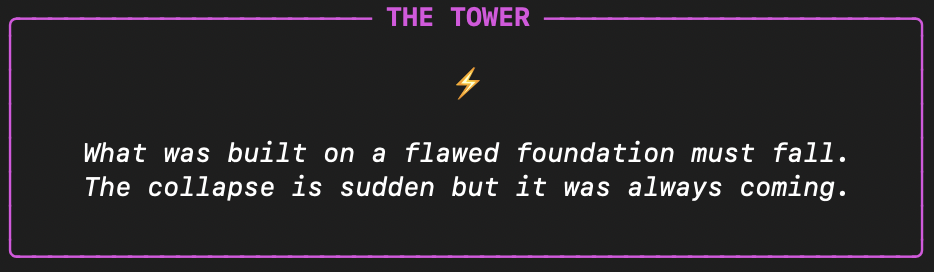
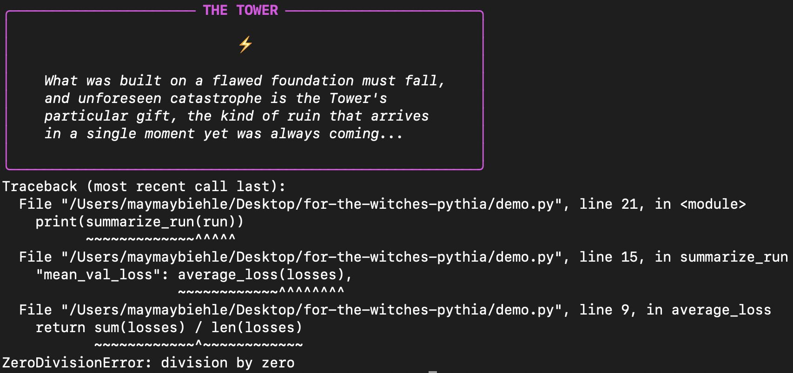

For the witches...

When your code fails, the universe is trying to tell you something.



# pythia

`pythia` replaces Python's traceback with a tarot reading. The error is still there, but now it has meaning.

```bash
pip install pythia
```

```python
import pythia; pythia.enable()
```

## Example



## for the witches that enjoy some python magic 

Each exception is mapped to a card. The Major Arcana cover the existential failures (e.g. `RecursionError` = The Wheel of Fortune, `KeyboardInterrupt` = Death). The four suits cover the rest:

- Cups are value & data (`ValueError`, `KeyError`, `TypeError`)
- Swords is logic & syntax (`SyntaxError`, `AssertionError`, `NameError`)
- Wands is runtime & IO (`RuntimeError`, `OSError`, `TimeoutError`)
- Pentacles are resources (`MemoryError`, `OverflowError`, `StackOverflow`)

A reversed card means the exception was caught and re-raised (`__cause__` is set). The traceback still prints below the reading. Pythia interprets while your shit code leaps you into the astral realm.

## Spread mode

```python
pythia.enable(spread=True)
```

Draws three cards instead of one:
- Past aka where the call stack began
- Present aka the line that raised
- Future aka a suggestion (heuristic, not always wise)

## mistral is the source of inspiration

wake2vec mistral has had a forzen val for 1100 steps, so to deal with my frustrations, i consulted the cards. The training was still running, and something else manifested. Figured that if the machine was going to be cryptic, it might as well commit to the bit.

## Contributing

PRs welcome, especially:
- Card readings for exceptions not yet mapped
- Better mappings (argue your case in the PR description, all the witches are welcome)
- Library-specific decks (`pythia.decks.numpy`, `pythia.decks.django`)

## License

MIT
